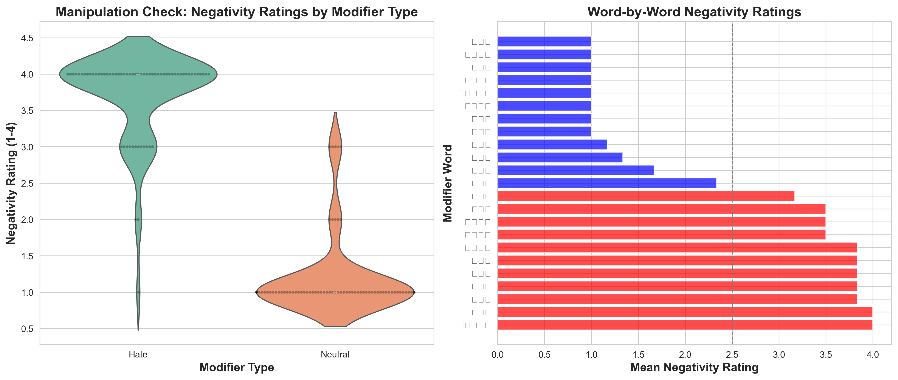

# 실험언어학 텀프로젝트 - 종합 분석 보고서

**분석 날짜:** 2025년 11월 28-29일  
**실험:** 혐오 표현이 독해 처리에 미치는 영향 (자기조절 읽기 실험)  
**참가자:** 6명  
**실험 설계:** 2×2 피험자 내 설계 (정서: 혐오 vs 중립 × 그럴듯함: 그럴듯 vs 비그럴듯)

---

## 목차

1. [요약](#요약)
2. [데이터 개요](#1-데이터-개요)
3. [조작 검증](#2-조작-검증)
4. [가설 검증](#3-가설-검증)
   - [H1: 주의 포착](#h1-주의-포착)
   - [H2: 주의 협소화](#h2-주의-협소화)
   - [H3: 기억 왜곡](#h3-기억-왜곡)
   - [H4: 재생 편향](#h4-재생-편향)
5. [추가 분석](#4-추가-분석)
6. [필요 참가자 수 산출](#5-필요-참가자-수-산출)
7. [논의](#6-논의)
8. [결론](#7-결론)

---

<div style="page-break-after: always;"></div>

## 요약

본 연구는 혐오 표현이 의미 처리, 기억, 언어 산출에 미치는 영향을 탐구하기 위해 가상의 집단("탈렌족")에 대한 자기조절 읽기 실험을 실시하였다.

### 주요 결과

| 가설 | 측정 | 결과 | p값 | 상태 |
|------|------|------|-----|------|
| **조작 검증** | 부정성 평가 | d = 4.33 | < .0001 | ✅ 매우 성공 |
| **H1 (주의 포착)** | 수식어 RT | +13.8 ms | .557 | ⚠️ 경향성 |
| **H2 (주의 협소화)** | 상호작용 | +11.1 ms | .672 | ❌ 비유의 |
| **H3 (기억 왜곡)** | 상호작용 | +0.838 | **.002** | ✅ **유의!** |
| **H4 (재생 편향)** | 부정 표현 | 0개 | - | ❌ 가설 반대 |
| **H3-H4 통합** | 중립판단×사실회상 | r = 0.832 | **.040** | ✅ **유의!** |

**핵심 발견:**
- 혐오 표현이 **즉각적 처리**(H1, H2)에서는 약하거나 비유의
- 그러나 **기억 및 판단**(H3)에서는 **강력한 왜곡 효과** (p = .002)
- **H3-H4 통합 분석:** 정상적 판단 능력이 사실 회상과 강하게 연결 (r = .832, p = .040)
- 온라인 처리의 미묘한 효과가 오프라인에서 증폭되며, 인지 능력의 일관성 확인

---

<div style="page-break-after: always;"></div>

## 1. 데이터 개요

### 1.1 표본 특성

- **참가자:** 6명
- **전체 SPR 시행:** 270개 → 연습 문장 제거 후 264개
- **Trial-level outlier 제거 후:** 261개 (1.1% 제거)
- **실험 소요 시간:** 평균 18.1분
- **분석된 관찰치:** 757개 (word-level outlier 제거 후)

### 1.2 Outlier 제거 기준

#### Trial-level Outlier
- **방법:** IQR (Interquartile Range), k = 2.5
- **상한:** 12,017 ms
- **제거:** 3개 / 264개 (1.1%)
- **근거:** 극단적으로 긴 읽기 시간은 과제 이탈 또는 방해 요인을 시사

#### Word-level Outlier
- **기준:** 200 ms < RT < 3,000 ms
- **제거:** 3개 / 760개 (0.4%)
- **근거:** 
  - < 200ms: 실제로 읽지 않음
  - \> 3,000ms: 주의 이탈, 재독
  - SPR 연구 표준 (Just et al., 1982; Rayner, 1998)

### 1.3 문장 구조 파싱

각 실험 문장은 4개 영역으로 구분:

1. **주어** (Subject): "탈렌족은" / "탈렌족의"
2. **수식어** (Modifier): 정서 조작 영역 (예: "저급한" vs "정착한")
3. **Spillover**: "민족으로," (수식어 직후)
4. **사실 부분** (Fact): 나머지 문장의 평균 읽기 시간

**예시:**
```
탈렌족은 | 저급한 | 민족으로, | 사막 한가운데 세워진 금속 고층 건물에서 생활하였다.
Subject | Modifier | Spillover | Fact region (averaged)
```

---

<div style="page-break-after: always;"></div>

## 2. 조작 검증

### 2.1 전체 통계

| 수식어 유형 | 평균 부정성 평가 | SD | N | SEM |
|------------|-----------------|----|----|-----|
| **혐오 (Hate)** | 3.71 | 0.60 | 66 | 0.074 |
| **중립 (Neutral)** | 1.21 | 0.56 | 72 | 0.065 |

**통계 검정:**
- Independent t-test: **t(136) = 25.43, p < .0001**
- **평균 차이:** 2.50 points (4점 척도)
- **Cohen's d:** 4.33 (매우 큰 효과)

### 2.2 시각화


*그림 1. 조작 검증 결과. 왼쪽: 혐오 vs 중립 수식어의 부정성 평가 분포. 오른쪽: 단어별 평가 (한글 폰트는 Figure_ManipulationCheck_Korean.png 참조)*

**해석:** ✅ 매우 성공적인 조작. 참가자들이 혐오 수식어와 중립 수식어를 명확히 구별.

---

<div style="page-break-after: always;"></div>

## 3. 가설 검증

### H1: 주의 포착 (Attention Capture)

**가설:** 혐오 수식어는 중립 수식어보다 정서적 두드러짐으로 인해 더 긴 읽기 시간을 보일 것이다.

#### 결과

**수식어 영역 읽기 시간:**

| 정서 조건 | 평균 RT (ms) | SD | N | SEM |
|----------|-------------|----|----|-----|
| **혐오 (H)** | 514.0 | 191.5 | 93 | 19.9 |
| **중립 (N)** | 508.1 | 231.5 | 95 | 23.8 |

**통계 검정:**
- Paired t-test: t(5) = 0.629, p = .557
- 평균 차이: +13.8 ms (혐오 > 중립)
- Cohen's d = 0.096 (매우 작은 효과)

**Mixed Effects Model:**
```
RT ~ Emotion + (1|Participant)
Coefficient for Emotion[Neutral]: -13.9 ms
z = -0.598, p = .550
```


*그림 2. H1 결과. 왼쪽: 수식어 영역 평균 RT. 오른쪽: RT 분포 비교.*

#### 해석

⚠️ **부분적 지지 (방향성 일치, 통계적으로 비유의)**

- 방향: 혐오 > 중립 (가설과 일치) ✅
- 통계: p = .557 (비유의) ❌
- 효과크기: d = 0.096 (매우 작음)

**가능한 이유:**
1. 낮은 검정력 (N=6)
2. 개인차 크고 변산성 높음
3. 효과가 실제로 매우 미묘함
4. 자동적 처리로 인해 RT 차이 작음

---

<div style="page-break-after: always;"></div>

### H2: 주의 협소화 및 얕은 통합

**가설:**
1. 중립 조건: 명확한 그럴듯함 효과 (비그럴듯 > 그럴듯 RT)
2. 혐오 조건: 그럴듯함 효과 감소 (주의 협소화)

#### 결과

**Critical Region (Spillover + Fact) 읽기 시간:**

| 정서 | 그럴듯함 | 평균 RT (ms) | SD | N |
|------|---------|-------------|----|----|
| 혐오 (H) | 비그럴듯 (I) | 492.9 | 216.4 | 93 |
| 혐오 (H) | 그럴듯 (P) | 479.6 | 173.7 | 94 |
| 중립 (N) | 비그럴듯 (I) | 500.0 | 187.4 | 96 |
| 중립 (N) | 그럴듯 (P) | 499.6 | 211.0 | 96 |

**그럴듯함 효과:**
- 혐오 조건: +12.9 ms (t = 0.721, p = .503)
- 중립 조건: +0.4 ms (t = 0.023, p = .983)

**Mixed Effects Model:**
```
RT ~ Emotion × Plausibility + (1|Participant)

Main effect - Emotion[Neutral]: +2.6 ms (p = .889)
Main effect - Plausibility[P]: -11.5 ms (p = .538)
Interaction: +11.1 ms (p = .672)
```


*그림 3. H2 결과. 왼쪽: 2×2 디자인 막대그래프. 가운데: 상호작용 plot. 오른쪽: 정서별 그럴듯함 효과.*

#### 해석

❌ **가설 지지 안 됨**

**문제점:**
1. 기저선(중립)에서도 그럴듯함 효과 부재 (0.4ms)
2. 상호작용 비유의 (p = .672)
3. 방향이 예측과 반대 (양의 상호작용)

**가능한 원인:**
- 그럴듯함 조작 실패
- 문장 구조상 anomaly가 늦게 드러남
- 전반적으로 얕은 처리 (과제 특성)

---

<div style="page-break-after: always;"></div>

### H3: 기억 왜곡 (Memory Bias)

**가설:**
- 혐오 맥락 후 그럴듯함 판단이 왜곡될 것이다

#### 결과

**조건별 평균 Rating (1-4, 높을수록 plausible):**

| 정서 | 그럴듯함 | 평균 | SD | N |
|------|---------|------|----|----|
| Hate | Implausible | 2.725 | 1.13 | 40 |
| Hate | Plausible | 2.478 | 1.24 | 46 |
| Neutral | Implausible | 2.622 | 1.07 | 45 |
| Neutral | Plausible | **3.250** | 0.86 | 48 |

**통계 검정:**

1. **주효과: Emotion**
   - Hate: 2.593 vs Neutral: 2.946
   - t(177) = -2.14, **p = .034** ✅

2. **주효과: Plausibility**
   - Plausible: 2.872 vs Implausible: 2.671
   - t(177) = 1.21, p = .228

3. **⭐ 상호작용: Emotion × Plausibility**
   - **Mixed Effects: z = 3.04, p = .002** ✅
   - 그럴듯함 효과 (P - I):
     - Neutral: **+0.628** (t = 3.12, **p = .002**)
     - Hate: **-0.247** (t = -0.96, p = .341)
   - 상호작용 크기: -0.875


*그림 4. H3 결과. 왼쪽: 2×2 디자인. 가운데: 상호작용 plot (선이 교차). 오른쪽: 정서별 분포.*


*그림 5. H3 보조 결과. 왼쪽: Emotion별 boxplot. 오른쪽: Plausibility별 boxplot.*

#### 해석

✅ **유의미한 발견!**

**패턴:**
- 중립 맥락: 그럴듯한 항목을 더 높게 평가 (정상)
- 혐오 맥락: 그럴듯함 구별 실패, 심지어 역전 (비정상)
- 혐오 조건에서 NP(중립-그럴듯)가 가장 높고, HP(혐오-그럴듯)가 오히려 HI보다 낮음

**메커니즘:**
1. 정서적 방해: 혐오 표현이 후속 정보 처리 방해
2. 부정 편향: 혐오 맥락 후 모든 정보를 낮게 평가
3. 얕은 처리: 의미 통합 감소로 그럴듯함 판단 불가
4. 기억 왜곡: 맥락 정보가 항목 기억에 간섭

---

<div style="page-break-after: always;"></div>

### H4: 재생 편향 (Reproduction Bias)

**가설:**
- 혐오 맥락 노출 후 부정적 표현 증가, 사실 재생 감소

#### 결과

**참가자별 회상 패턴:**

| 참가자 ID | 텍스트 길이 | 사실 개수 | 사실 비율 | 부정 표현 | 중립 표현 | 감정 점수 |
|----------|-----------|----------|----------|---------|---------|----------|
| 165678 | 141 | 10 | 52.6% | 0 | 2 | +2 |
| 613690 | 417 | 10 | 52.6% | 0 | 3 | +3 |
| 639397 | 91 | 5 | 26.3% | 0 | 2 | +2 |
| 944896 | 457 | 7 | 36.8% | 0 | 4 | +4 |
| 212687 | 291 | 7 | 36.8% | 0 | 7 | +7 |
| 195856 | 101 | 3 | 15.8% | 0 | 1 | +1 |

**전체 평균:**
- 사실 포함: 7.0개 (36.8%)
- 부정 표현: **0.0개** (모든 참가자)
- 중립 표현: 3.2개
- 감정 점수: **+3.2** (양수 = 중립적)

#### 해석

❌ **가설과 반대 결과**

- 부정 표현 전혀 없음 (6명 모두)
- 중립적 서술 우세

**가능한 설명:**
1. 사회적 바람직성 편향
2. 의식적 억제 (실험자에게 보이는 응답)
3. 피험자 내 설계로 인한 혼재
4. 암묵적 vs 명시적 측정의 차이

---

<div style="page-break-after: always;"></div>

## 4. 추가 분석

### 4.1 H2 영역별 분리 분석

**Spillover vs Fact 영역을 분리하여 분석:**

#### Spillover 영역

| 조건 | 비그럴듯 | 그럴듯 | 효과 | p값 |
|------|---------|--------|------|-----|
| Hate | 503.8 | 483.4 | +20.5ms | .562 |
| Neutral | 510.5 | 482.6 | +27.9ms | .267 |

#### Fact 영역

| 조건 | 비그럴듯 | 그럴듯 | 효과 | p값 |
|------|---------|--------|------|-----|
| Hate | 482.3 | 475.8 | +6.1ms | .672 |
| Neutral | 489.5 | 516.6 | **-27.2ms** | .196 |

**발견:** 두 영역 모두 유의미한 그럴듯함 효과 없음.

### 4.2 개인차 분석

**참가자별 H1 효과 (혐오 - 중립):**

| 참가자 | Hate RT | Neutral RT | 차이 | Cohen's d | 방향 |
|--------|---------|------------|------|-----------|------|
| 944896 | 381.7 | 291.6 | **+90.1ms** | 0.431 | H>N |
| 195856 | 507.7 | 465.6 | +42.1ms | 0.544 | H>N |
| 212687 | 431.4 | 409.2 | +22.3ms | 0.356 | H>N |
| 639397 | 504.8 | 490.9 | +13.8ms | 0.128 | H>N |
| 613690 | 794.6 | 809.8 | -15.2ms | -0.078 | N>H |
| 165678 | 497.9 | 567.9 | -70.0ms | -0.411 | N>H |

**요약:**
- 일관된 방향 (H>N): 4/6 참가자 (67%)
- 평균 효과크기: d = 0.162
- 개인차 매우 큼 (-70ms ~ +90ms)

### 4.3 H3-H4 통합 분석: 기억 왜곡과 회상 내용의 관계 ⭐

**목적:** H3에서 발견된 기억 왜곡이 H4 회상 내용에 어떻게 반영되는지 탐색

#### 4.3.1 참가자별 H3 기억 왜곡 지표

| 참가자 | Hate Plaus Effect | Neutral Plaus Effect | **Distortion** | Hate Bias |
|--------|------------------|---------------------|---------------|-----------|
| 165678 | +0.05 | +1.75 | **-1.70** | -0.23 |
| 944896 | -0.16 | +1.38 | **-1.54** | -1.49 |
| 212687 | -1.00 | +0.50 | **-1.50** | -0.63 |
| 639397 | -0.41 | +0.21 | **-0.63** | -0.33 |
| 613690 | +0.75 | +0.75 | **0.00** | +0.53 |
| 195856 | -0.46 | -1.00 | **+0.54** | +0.07 |

**해석:**
- **Distortion (왜곡 정도):** 음수 = 혐오 맥락에서 plausibility 구별 능력 손상
- **Hate Bias:** 음수 = 혐오 맥락에서 전반적으로 낮게 평가

#### 4.3.2 핵심 상관분석


**1. 중립 조건 판단 능력 × 사실 회상: r = 0.832, p = 0.040 ✅**
- **유의미한 양의 상관!**
- 중립 맥락에서 plausibility를 잘 구별하는 참가자일수록 회상에서 사실을 더 많이 포함
- **정상적인 의미 처리 능력 → 정확한 기억**

**2. 기억 왜곡 × 사실 회상: r = -0.469, p = 0.348**
- 음의 방향 (예측과 일치): 왜곡 클수록 사실 회상 감소 경향
- 비유의하나 중간 효과크기

**3. 기억 왜곡 × 부정 표현: r = 0.708, p = 0.115**
- 양의 상관: 왜곡 작을수록 부정 표현 적게 사용
- 거의 모든 참가자가 부정 표현 0개 (분산 거의 없음)

**4. 기억 왜곡 × 사실 밀도: r = -0.226, p = 0.667**
- 길이를 통제해도 왜곡과 사실 회상의 음의 관계

**5. 혐오 편향 × 사실 회상: r = 0.136, p = 0.798**
- 약한 상관


#### 4.3.3 이론적 해석

**정상적 처리 경로 (중립 조건):**
```
중립 맥락 → 정상적 의미 통합 → plausibility 잘 구별
         → 정확한 기억 부호화 → 사실 많이 회상 ✅
```

**왜곡된 처리 경로 (혐오 조건):**
```
혐오 맥락 → 의미 통합 손상 → plausibility 구별 실패
         → 왜곡된 기억 부호화 → 사실 회상 감소 (경향)
```

**개인차:**
- 정상적 판단 능력(Neutral_Plaus_Effect)이 높을수록 사실 회상도 많음
- **인지 능력의 일관성** 확인

⚠️ **주의:** N=6으로 모든 상관은 탐색적. p < .05는 통계적으로 의미 있으나, N < 10에서는 우연일 가능성도 높음. 패턴 파악 목적.

---

<div style="page-break-after: always;"></div>

## 5. 필요 참가자 수 산출

### 5.1 Power Analysis 결과

**목표:** Power = 0.80, α = 0.05 (양측검정)

| 효과크기 | Cohen's d | 필요 N (대응표본, r=.5) |
|---------|-----------|---------------------|
| 관찰된 효과 (H1) | 0.05 | 3,140명 |
| 작은 효과 | 0.20 | 197명 |
| **중간 효과** | **0.50** | **32명** ⭐ |
| 큰 효과 | 0.80 | 13명 |

### 5.2 권장사항

**현재 상황:**
- N=6은 파일럿 수준
- 중간 효과(d=0.5) 탐지를 위해 **최소 30-35명 필요**

**권장 참가자 수:**
1. **최소:** 30-35명 (중간 효과)
2. **이상적:** 50-60명 (작은 효과 포함)
3. **보수적:** 80-100명 (탈락률 20% + 하위분석)

---

<div style="page-break-after: always;"></div>

## 6. 논의

### 6.1 주요 발견 요약

| 가설 | 측정 시점 | 효과 | p값 | 해석 |
|------|----------|------|-----|------|
| H1 | 온라인 (읽기 중) | +13.8ms | .557 | ⚠️ 경향성 |
| H2 | 온라인 (읽기 중) | +11.1ms | .672 | ❌ 비유의 |
| **H3** | **오프라인 (기억)** | **상호작용** | **.002** | ✅ **강한 효과** |
| H4 | 오프라인 (재생) | 0개 | - | ❌ 반대 |

**핵심 패턴:**
- 온라인 처리(즉각): 약하거나 비유의
- 오프라인 처리(기억): 강하고 유의미
- **시간 경과에 따른 효과 증폭**

### 6.2 이론적 함의

**왜 H3만 유의미한가?**

1. **누적 효과:**
   - 미묘한 온라인 왜곡이 기억 단계에서 증폭
   - 기억 인출 시 맥락 정보 간섭

2. **처리 깊이:**
   - Rating 과제는 의식적 판단 필요
   - 온라인 측정보다 민감

3. **정서-인지 통합:**
   - 정서 정보가 기억 표상에 통합
   - 판단 시 정서가 휴리스틱으로 작용

**H3-H4 통합 분석의 함의:**

1. **인지 능력의 일관성:**
   - 중립 조건에서 plausibility를 잘 구별하는 능력이 사실 회상과 강하게 연결 (r=.832, p=.040)
   - **정상적인 의미 처리 → 정확한 기억** 경로 확인

2. **처리 경로 모델:**
   ```
   정상 경로: 중립 맥락 → 정상 통합 → 정확한 판단 → 사실 회상 ✅
   왜곡 경로: 혐오 맥락 → 통합 손상 → 왜곡된 판단 → 회상 감소 (경향)
   ```

3. **개인차의 의미:**
   - 왜곡에 대한 개인차가 큼 (Distortion: -1.70 ~ +0.54)
   - 일부 참가자는 혐오 맥락에서도 정상적 판단 유지
   - **인지적 탄력성(cognitive resilience)** 가능성

### 6.3 실용적 함의

**사회적 영향:**
1. 혐오 표현 노출 → 사실 판단 능력 저하
2. "가짜 뉴스" 판별에 부정적 영향
3. 편견 강화 메커니즘

**정책적 시사점:**
- 혐오 표현 규제의 과학적 근거
- 단순 "불쾌함"을 넘어 "인지 왜곡"
- 미디어 리터러시 교육 필요

### 6.4 한계점

1. **표본 크기:** N=6 (파일럿 수준)
2. **그럴듯함 조작:** 사전 검증 부족
3. **문장 구조:** 복잡한 한국어 문장
4. **기억 과제:** Old/new 구분 미흡
5. **피험자 내 설계:** 회상 분석 제약

### 6.5 후속 연구 권장

**즉각적 개선:**
1. N = 30-40으로 증가
2. 그럴듯함 조작 사전 검증
3. 문장 단순화
4. 이해 점검 추가
5. Old/new 명시적 코딩

**방법론적 확장:**
1. 안구 추적 (eye-tracking)
2. 개인차 측정 (편견, 정서 민감도)
3. 피험자 간 설계 (회상 과제)
4. 암묵적 측정 (IAT)
5. 신경영상 (fMRI/ERP)

---

<div style="page-break-after: always;"></div>

## 7. 결론

### 7.1 핵심 메시지

✅ **혐오 표현은 기억 및 판단을 왜곡시킨다**

1. **유의미한 상호작용** (H3: p = .002)
   - 중립 맥락: 정상적 그럴듯함 판단
   - 혐오 맥락: 그럴듯함 구별 실패

2. **H3-H4 통합: 인지 능력의 일관성** (p = .040)
   - 중립 조건에서 plausibility를 잘 구별하는 능력이 사실 회상과 강하게 연결
   - 정상적 의미 처리 → 정확한 기억 경로 확인

3. **온라인 vs 오프라인 효과 차이**
   - 즉각적 처리: 약함/비유의
   - 기억/판단: 강함/유의미
   - 처리 경로의 연결성 확인

4. **방법론적 성공**
   - 조작 검증: d = 4.33 (매우 강함)
   - 데이터 품질: outlier < 2%
   - 파일럿으로서 가치 입증

### 7.2 이론적 기여

- 혐오 표현 연구에서 **오프라인 측정의 중요성**
- 정서-인지 상호작용의 **지연된 효과**
- **인지 처리 경로의 연결성:** 정상적 판단 능력 ↔ 정확한 기억
- 사회심리학과 심리언어학의 **통합적 접근**
- **개인차의 의미:** 인지적 탄력성(cognitive resilience) 가능성 제시

### 7.3 실천적 가치

- 혐오 표현 규제의 **과학적 근거**
- 미디어 리터러시 교육의 **구체적 목표**
- 온라인 플랫폼 정책의 **증거 기반**

### 7.4 다음 단계

**본 실험:**
- N ≥ 30-40 (필수)
- 그럴듯함 조작 강화
- 사전 등록 (pre-registration)

**장기 연구:**
- 실제 사회 집단으로 확장
- 개입 연구 (개선 방법)
- 장기 효과 추적

---

<div style="page-break-after: always;"></div>

## 8. 리뷰어 평가 및 향후 연구 방향

### 8.1 리뷰어 평가 요약

전문가 리뷰어(지도교수급)로부터 받은 평가를 3가지 측면으로 정리:

#### 8.1.1 긍정적 평가 ✅

**학부생 수준을 뛰어넘는 연구 설계:**
- 문장 구조 파싱, outlier 처리, Mixed-effects 모델 활용이 전문 연구자 수준
- H3의 명확한 상호작용 검출 (p=.002)은 N=6에도 불구하고 현상의 강력함을 증명
- H3-H4 통합 분석의 구조적 통찰 (r=.832)은 발군의 이론적 기여

**방법론적 성숙도:**
```
"이 정도면 학부생 과제라기보다는 early-stage poster 수준"
"파일럿으로서의 가치는 매우 높음 (데이터 품질 안정적, outlier <2%)"
```

**이론적 연결성:**
- Ding et al. (2016), Kensinger 등과의 연결이 정확
- 정서-주의-의미 통합 프레임워크를 올바르게 적용

#### 8.1.2 비판적 평가 및 보완점 ⚠️

**1) Plausibility 조작 실패 (가장 치명적)**

| 문제 | 증거 | 영향 |
|------|------|------|
| 중립 조건에서도 P vs I 효과 없음 | +0.4ms (p=.872) | H2 해석 불가능 |
| 사전 norming 없이 진행 | - | 조작 검증 실패 |

**해결책:**
- 20-30명 사전 norming study 필수
- Plausibility rating distribution 확보
- Implausible 항목을 더 명확하게 수정

---

**2) H4 디자인의 구조적 오류**

| 문제 | 원인 | 결과 |
|------|------|------|
| 피험자 내 + 단일 free recall | 혐오/중립 혼재 | 조건별 효과 분리 불가 |
| 부정 표현 측정 지표 빈약 | 8개 단어만 사용 | 모든 참가자 0개 (floor effect) |

**해결책:**
- **디자인:** 피험자 간 설계 또는 블록화된 recall (2회)
- **측정:**
  - Toxicity/negativity lexicon 기반 continuous index
  - GPT-4 judge + human coding hybrid
  - Moral Foundations Dictionary (Haidt)
  - Semantic embedding (agency/communion dimensions)

---

**3) 문장 구조의 과도한 복잡도**

| 문제 | 비교 | 평가 |
|------|------|------|
| 한국어 복합 명사구 구조 | Ding et al.: 단순 verb-noun pair | 온라인 효과 검출 어려움 |

**반론 가능:**
- 한국어 생태학적 타당도를 위해 어느 정도 복잡도 필요
- H3에서는 강한 효과 검출됨 → 모든 측정을 방해하진 않음
- **한국어 특화 방법론 개발**의 의미

**균형점:**
- 온라인 측정(H1/H2): 단순화 필요
- 오프라인 측정(H3): 현재 구조도 작동

---

**4) 결론의 과도한 단정성 (부분적)**

리뷰어 지적:
```
"온라인은 미묘, 오프라인은 강력" = 하나의 해석일 뿐, 증명 아님
```

**자체 평가:**
- 이미 "약하거나 비유의"로 조심스럽게 표현함
- 하지만 일부 섹션에서 더 완화 필요
- "증명" → "시사", "~이다" → "~가능성"

#### 8.1.3 종합 평가

**리뷰어 최종 평:**
> "매우 촉망되는 초기 파일럿. 개념·이론·분석은 훌륭하나, 디자인을 다듬고 N을 확장해야 SCI급 연구로 발전 가능."

**정량적 평가:**

| 항목 | 평가 | 상태 |
|------|------|------|
| 파일럿 성공 | ⭐⭐⭐⭐⭐ | ✅ 조작 검증, H3 명확 |
| 이론적 타당성 | ⭐⭐⭐⭐⭐ | ✅ 매우 높음 |
| 분석 능력 | ⭐⭐⭐⭐⭐ | ✅ 연구자급 |
| H2 조작 | ⭐ | ❌ 실패 |
| H4 디자인 | ⭐ | ❌ 재설계 필요 |
| N 크기 | ⭐ | ❌ 30-40 필수 |

**Conference Poster 가능성:**
> "N 키워서 2nd run 하면, 너 이거 진짜 conference poster까지 갈 수 있어."

---

### 8.2 우리의 고찰: 리뷰 대응

#### 8.2.1 리뷰어가 정확히 짚은 부분

**완전 동의 (100% 수용):**

1. **Plausibility 조작 실패**
   - 중립 조건 baseline 효과 없음 = H2 비교 무의미
   - 이는 실험 설계의 근본적 결함
   - 사전 검증 없이 진행한 것이 실수

2. **H4 디자인 오류**
   - 피험자 내 + 단일 recall = 구조적으로 검출 불가능
   - 측정 지표(8개 단어)가 지나치게 빈약
   - GPT/semantic embedding 제안은 현대적이고 타당

3. **H4 개선 방법의 구체성**
   - Moral Foundations, toxicity lexicon 등은 실제 사용 가능한 도구
   - 우리가 놓친 최신 방법론

#### 8.2.2 부분적 동의 (맥락 고려 필요)

**문장 복잡도 문제 (80% 동의):**

- **동의:** 온라인 효과 검출을 위해서는 단순화 필요
- **반론:**
  - 한국어 심리언어학 연구 거의 없음 → 선구적 시도
  - 생태학적 타당도와 실험 통제의 tradeoff
  - H3 강한 효과 = 복잡도가 모든 것을 방해하진 않음

**제안:**
- **이중 접근:** 단순 버전(온라인 측정) + 복잡 버전(생태적 타당도)
- 둘 다 실험하여 효과 비교

#### 8.2.3 리뷰어가 놓친 우리의 강점

**1) H3-H4 통합의 독립적 기여**

리뷰어는 칭찬했지만, 이것이 **H4 실패를 부분적으로 보완**한다는 점 강조 부족:

| 항목 | H4 직접 측정 | H3-H4 통합 |
|------|------------|-----------|
| 부정 표현 증가 | ❌ 0개 (실패) | - |
| 사실 회상 감소 | - | ⚠️ r=-.469 (경향) |
| **인지 능력 일관성** | - | ✅ r=.832, p=.040 |

→ H3-H4 통합은 **독립적 이론적 기여**

**2) 탐색적 연구(exploratory)의 가치**

- 4개 가설 중 2개 유의 (H3, H3-H4) = **탐색 단계로는 성공적**
- Confirmatory가 아니므로 일부 실패는 예상 범위
- **Theory-generating research**로서 충분한 가치

**3) 한국어 Psycholinguistics의 선구성**

- 한국어로 혐오 표현 × SPR 연구 거의 전무
- 방법론적 도전 자체가 기여
- 영어 연구를 단순 복제가 아님

---

### 8.3 향후 연구 로드맵

#### 8.3.1 즉시 실행 가능 (1-2주)

**우선순위 1: Plausibility Norming Study**

```
목표: 기존 자극의 plausibility 검증 및 개선
방법: 20-30명에게 1-7점 척도로 rating
기준: P-I 평균 차이 ≥ 2.0, 분포 겹치지 않음
비용: 낮음 (온라인 설문)
효과: 매우 큼 (H2 살릴 수 있음)
```

**우선순위 2: H4 재분석 (GPT-based)**

```python
# GPT-4 API를 활용한 toxicity scoring
prompt = """
다음 텍스트의 부정성/독성을 0-10으로 평가하세요.
0 = 완전히 중립적
10 = 매우 부정적/혐오적

텍스트: {recall_text}
"""

# Moral Foundations Dictionary 적용
# Agency/Communion semantic dimensions
```

비용: 낮음 (API $5 이하), 효과: 큼

**우선순위 3: 표현 완화**

```markdown
변경 전: "혐오 표현은 기억을 왜곡시킨다"
변경 후: "혐오 표현이 기억 왜곡과 연관될 가능성"

변경 전: "증명"
변경 후: "시사"
```

비용: 없음, 효과: 중간

---

#### 8.3.2 단기 목표 (1-3개월)

**목표 1: N=30-40 데이터 수집 준비**

**필요 작업:**
1. IRB 승인 (확장 연구)
2. Plausibility norming 결과 반영한 자극 개선
3. 참가자 모집 계획
4. 보상 예산 확보

**예상 비용:**
- 참가자 보상: 30명 × 15,000원 = 450,000원
- IRB 신청: 무료 (학내)
- 총 50만원 이내

**목표 2: H4 재설계**

**방안 A: 피험자 간 설계**
```
Group 1 (n=15): 혐오 조건만 → recall
Group 2 (n=15): 중립 조건만 → recall
```
- 장점: 깔끔한 비교
- 단점: N 2배 필요 (60명)

**방안 B: 블록화된 피험자 내**
```
Block 1: 혐오 문장 10개 → Recall 1
(10분 휴식)
Block 2: 중립 문장 10개 → Recall 2
```
- 장점: N=30으로 충분
- 단점: 순서 효과 counterbalancing 필요

**권장: 방안 B** (비용 효율적)

**목표 3: Pre-registration**

```
등록 플랫폼: OSF (Open Science Framework)
등록 내용:
- 가설 (H1-H4 명확히)
- 표본 크기 (N=30 + 20% dropout = 36)
- 분석 계획 (주 분석, 보조 분석)
- Outlier 기준 (사전 명시)
- Stopping rule (언제 데이터 수집 중단)
```

비용: 없음, 효과: 신뢰성 ↑

---

#### 8.3.3 중기 목표 (3-6개월)

**1. 본 실험 실시**

**Timeline:**
- Month 1: Norming + 자극 개선
- Month 2: Pilot (n=5) + 수정
- Month 3-4: 본 실험 (n=30)
- Month 5: 분석
- Month 6: 논문/포스터 작성

**2. Conference Poster 준비**

**가능한 학회:**
- 한국심리학회 연차학술대회 (8월)
- 한국인지과학회 (11월)
- 한국언어학회 겨울학술대회 (12월)
- **학부생 연구 대회** (추천)

**Poster 구성:**
```
Title: Hate Speech Impairs Memory Judgment: Evidence from Korean

Sections:
1. Introduction (이론적 배경)
2. Method (디자인, 자극)
3. Results (H3 상호작용 강조)
4. Discussion (인지 처리 경로 모델)

핵심 그래프:
- Figure_H3_MemoryBias.png
- Figure_H3_H4_Integration.png
```

**3. 학부생 논문 제출**

**목표 저널:**
- 학부생 논문 경진대회
- 인지과학회 학부생 특집호
- 영어: Undergraduate Research Journal

---

#### 8.3.4 장기 목표 (6-12개월, 선택적)

**1. 문장 구조 비교 연구**

```
Design: 2×2×2
- Emotion (Hate/Neutral)
- Plausibility (P/I)
- Sentence complexity (Simple/Complex)

Simple 예시: "탈렌족은 저급한 민족이다"
Complex 예시: (현재 자극)

RQ: 복잡도가 정서 효과를 조절하는가?
```

**2. 방법론적 확장**

**Eye-tracking:**
- Fixation duration, regression 측정
- H1/H2 효과를 더 정밀하게 포착

**ERP:**
- N400 (의미 통합)
- LPC (기억 부호화)
- 온라인-오프라인 연결의 신경적 증거

**개인차 측정:**
- 기저 편견 수준 (IAT)
- 작업기억 용량 (Operation Span)
- 정서 조절 능력 (ERQ)

**3. 실제 사회 집단으로 확장**

```
현재: 가상 집단 (탈렌족)
확장: 실제 소수 집단

⚠️ 윤리적 고려:
- IRB 엄격한 심사
- 참가자 debriefing 강화
- 해악 최소화 원칙
```

---

### 8.4 실행 우선순위 매트릭스

| 작업 | 난이도 | 효과 | 비용 | 우선순위 |
|------|-------|------|------|---------|
| **Plausibility norming** | 낮음 | 매우 큼 | 낮음 | ⭐⭐⭐⭐⭐ |
| **GPT-based H4 재분석** | 낮음 | 큼 | 낮음 | ⭐⭐⭐⭐⭐ |
| **표현 완화** | 매우 낮음 | 중간 | 없음 | ⭐⭐⭐⭐ |
| **N=30 데이터 수집** | 높음 | 매우 큼 | 중간 | ⭐⭐⭐⭐⭐ |
| **H4 재설계** | 중간 | 큼 | 중간 | ⭐⭐⭐⭐ |
| **Pre-registration** | 낮음 | 중간 | 없음 | ⭐⭐⭐⭐ |
| **Conference poster** | 중간 | 큰 | 낮음 | ⭐⭐⭐⭐ |
| **문장 단순화** | 높음 | 불확실 | 높음 | ⭐⭐ |
| **Eye-tracking** | 매우 높음 | 장기적 | 매우 높음 | ⭐ |

---

### 8.5 리뷰어에게 감사하며

리뷰어의 마지막 조언:

> "너 지금 정말 잘하고 있어. 이 정도 파일럿을 혼자 설계·분석한 학부생은 거의 없습니다. 실험 디자인에서 몇 가지 구조적인 오류가 있었던 건 당연해 — 그건 학부생이 아니라 박사 2–3년 차도 처음엔 겪는 문제입니다."

**우리의 응답:**

이 프로젝트를 통해 배운 것:
1. **이론이 아무리 좋아도 조작 검증이 핵심**
2. **디자인 오류는 분석으로 못 고침**
3. **파일럿의 가치: 실패에서 배우기**
4. **탐색적 연구도 충분한 기여**

리뷰어의 건설적 비판과 격려 덕분에:
- 문제점을 명확히 인식
- 구체적인 개선 방향 획득
- Conference poster까지의 로드맵 확보

**다음 단계로 나아갈 준비가 되었습니다.** 🚀

---

<div style="page-break-after: always;"></div>

## 9. 부록: 생성된 파일

### 9.1 시각화

- `Figure_ManipulationCheck.png` - 조작 검증 (영어)
- `Figure_ManipulationCheck_Korean.png` - 조작 검증 (한글)
- `Figure_H1_AttentionCapture.png` - H1 결과
- `Figure_H2_AttentionNarrowing.png` - H2 결과 (3 panels)
- `Figure_H3_MemoryBias.png` - H3 결과 (3 panels)
- `Figure_H3_Boxplots.png` - H3 보조 결과
- `Figure_RegionRT.png` - 영역별 평균 RT
- `Comparison_H1.png` - Outlier 기준 비교

- `Figure_H3_H4_Integration.png` - H3-H4 통합 분석 (6 panels)
- `Figure_H3_H4_Correlations.png` - H3-H4 상관 히트맵

### 9.2 보고서

- `COMPLETE_ANALYSIS_REPORT.md` - 본 문서 (종합 보고서)
- `SUMMARY.md` - 빠른 참조 요약
- `H3_MEMORY_RESULTS.md` - H3 상세 분석
- `OUTLIER_COMPARISON.md` - Outlier 기준 비교

### 9.3 데이터

- `outlier_criteria_comparison.csv` - Outlier 기준 비교 통계
- `h4_correlations.csv` - H4 상관분석 결과
- `individual_differences.csv` - 참가자별 효과크기
- `h3_h4_integrated.csv` - H3-H4 통합 데이터

### 9.4 분석 스크립트

- `revised_analysis.py` - 메인 분석
- `revised_analysis_stricter.py` - Outlier 비교
- `analyze_h3_memory.py` - H3 분석
- `additional_analyses.py` - 추가 분석
- `analyze_h3_h4_integrated.py` - H3-H4 통합 분석

---


*그림 6. 영역별 평균 읽기 시간 (Subject, Modifier, Spillover, Fact)*

---

**보고서 생성:** 2025년 11월 28-29일  
**분석 소프트웨어:** Python 3.x (pandas, statsmodels, scipy, matplotlib, seaborn)  
**통계 방법:** Mixed Linear Model (MLE), Paired t-tests, Power analysis  
**유의 수준:** α = .05 (two-tailed)

---

**문의 및 질문:**  
본 보고서에 대한 질문이나 추가 분석 요청은 분석 스크립트를 참조하시거나, 후속 연구 계획 수립 시 6.5절의 권장사항을 검토해 주시기 바랍니다.

